# 🚀 AWS ECS Fargate Flask CI/CD Pipeline

> A production-style Flask deployment using **Docker, Gunicorn, Amazon ECS Fargate, Amazon ECR, Application Load Balancer (ALB), CloudWatch Logs, and GitHub Actions CI/CD**.


---

# 📌 Project Overview

This project demonstrates a **production-style CI/CD deployment pipeline** for a containerized Flask application using **AWS ECS Fargate**.

The application is:

* Built with **Flask**
* Containerized using **Docker**
* Served in production using **Gunicorn**
* Stored in **Amazon ECR**
* Deployed to **Amazon ECS Fargate**
* Exposed through an **Application Load Balancer (ALB)**
* Monitored using **CloudWatch Logs**
* Automatically deployed using **GitHub Actions CI/CD**

The goal of this project was to simulate a **real-world DevOps workflow** where every code push automatically updates the live production application.

---

## 🏗️ Architecture Diagram

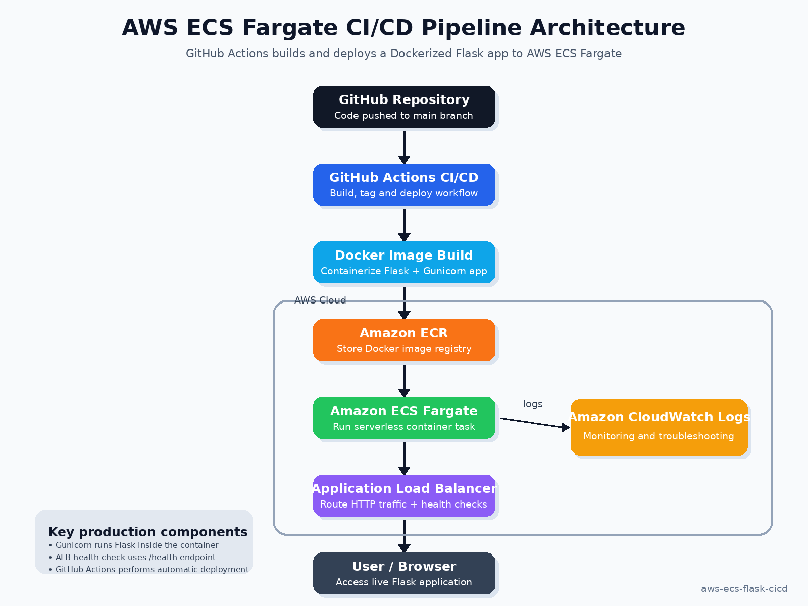

## Deployment Flow

```text
GitHub Repository
        ↓
GitHub Actions (CI/CD Pipeline)
        ↓
Docker Image Build
        ↓
Amazon ECR
        ↓
Amazon ECS Fargate
        ↓
Application Load Balancer (ALB)
        ↓
Flask Application
```

## CI/CD Workflow

```text
Code Change
    ↓
Git Push
    ↓
GitHub Actions Triggered
    ↓
Docker Image Build
    ↓
Push Image to Amazon ECR
    ↓
ECS Service Update
    ↓
Automatic Production Deployment
```

---

# 🛠️ Tech Stack

| Technology                | Purpose                      |
| ------------------------- | ---------------------------- |
| Flask                     | Web Application              |
| Gunicorn                  | Production WSGI Server       |
| Docker                    | Containerization             |
| Amazon ECS Fargate        | Serverless Container Hosting |
| Amazon ECR                | Docker Image Registry        |
| Application Load Balancer | Traffic Routing              |
| GitHub Actions            | CI/CD Automation             |
| AWS CloudWatch Logs       | Monitoring & Troubleshooting |
| AWS CLI                   | AWS Resource Management      |

---

# ✨ Features

✅ Flask Web Application

✅ Dockerized Deployment

✅ Production-ready **Gunicorn Server**

✅ Amazon ECS Fargate Deployment

✅ Application Load Balancer Integration

✅ Health Check Endpoint (`/health`)

✅ GitHub Actions CI/CD Pipeline

✅ Automatic Deployment on Push to `main`

✅ CloudWatch Monitoring & Logs

✅ Real-world DevOps Troubleshooting

---

# 📂 Project Structure

```bash
aws-ecs-flask-cicd/
│── .github/
│   └── workflows/
│       └── deploy-ecs.yml
│
│── screenshots/
│   ├── 01-app-running-homepage.png
│   ├── 02-health-check-working.png
│   ├── 03-ecs-cluster-active.png
│   ├── 04-ecs-service-running.png
│   ├── 05-target-group-healthy.png
│   ├── 06-ecr-image-pushed.png
│   ├── 07-cloudwatch-logs.png
│   ├── 08-github-repository.png
│   ├── 09-github-actions-success.png
│   └── 10-cicd-auto-deployment-proof.png
│
│── app.py
│── Dockerfile
│── requirements.txt
│── README.md
```

---

# 📸 Project Screenshots

## 1️⃣ Live Flask Application

Production application successfully running on AWS ECS Fargate.

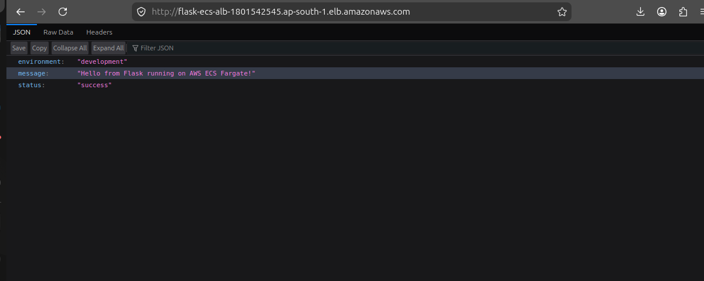

---

## 2️⃣ Health Check Endpoint

Health endpoint configured for ALB target group monitoring.

Endpoint:

```text
/health
```

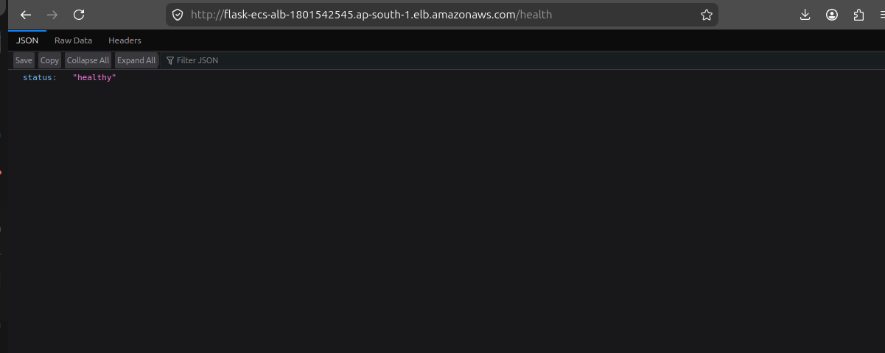

---

## 3️⃣ ECS Cluster Running

Amazon ECS cluster with running Fargate task.

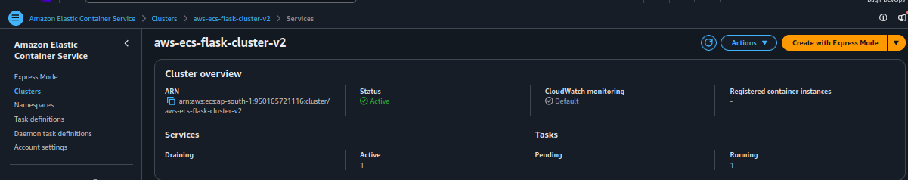

---

## 4️⃣ ECS Service Running

Running ECS service managing the Flask container.

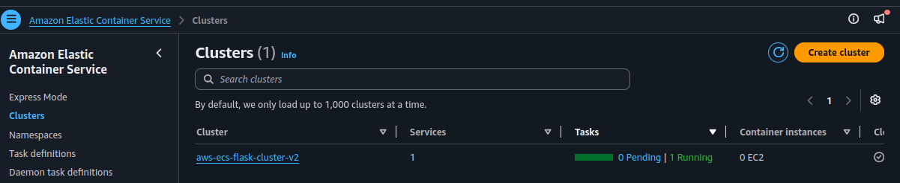

---

## 5️⃣ Target Group Healthy

ALB successfully routing traffic only to healthy ECS targets.

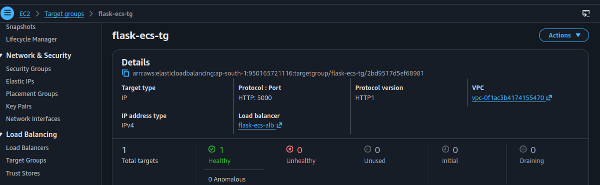

---

## 6️⃣ Docker Image Stored in Amazon ECR

Docker image pushed successfully to Amazon ECR.

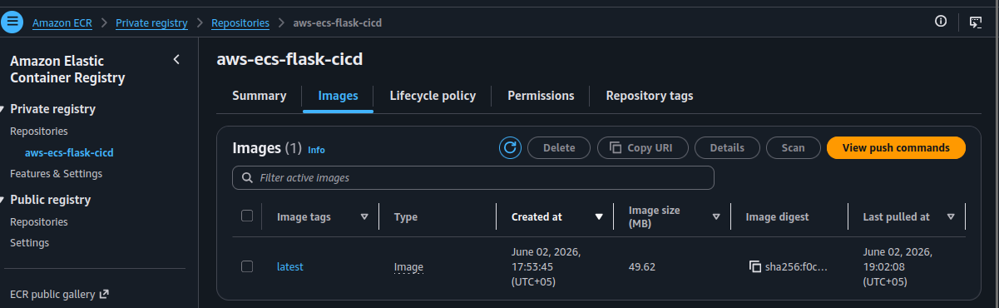

---

## 7️⃣ CloudWatch Logs

Container logs monitored for debugging and troubleshooting.

Gunicorn startup logs:

```text
Listening at: http://0.0.0.0:5000
Booting worker with pid
```

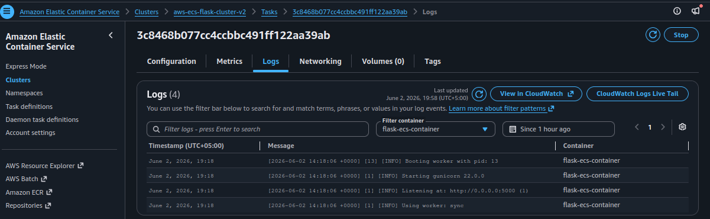

---

## 8️⃣ GitHub Repository Structure

Repository containing application code, Dockerfile, workflow file, and documentation.

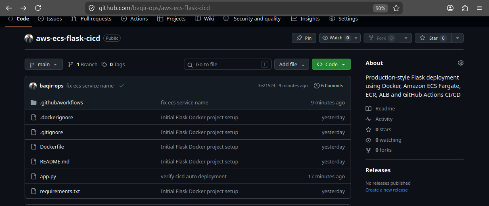

---

## 9️⃣ GitHub Actions CI/CD Success

Successful automated deployment pipeline.

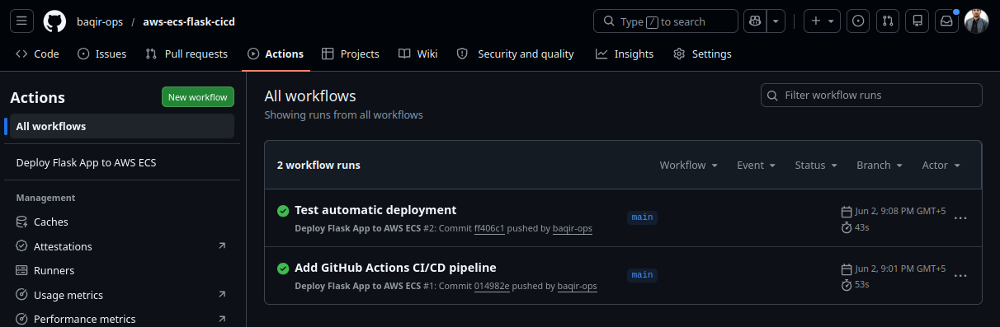

---

## 🔟 CI/CD Auto Deployment Verification

A code change was pushed to GitHub and automatically deployed to production through GitHub Actions.

Updated application message:

```text
Auto Deployment Verified!
```

This proves:

```text
Code Push → CI/CD Trigger → ECS Deployment → Live Update
```

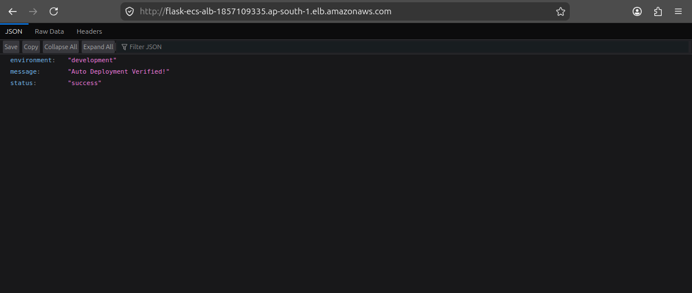

---

# ⚙️ Local Setup

## Clone Repository

```bash
git clone https://github.com/YOUR_USERNAME/aws-ecs-flask-cicd.git
cd aws-ecs-flask-cicd
```

---

## Create Python Environment

```bash
python3 -m venv venv
source venv/bin/activate
```

---

## Install Dependencies

```bash
pip install -r requirements.txt
```

---

## Run Flask App

```bash
python app.py
```

---

## Run with Gunicorn (Production)

```bash
gunicorn -b 0.0.0.0:5000 app:app
```

**Why Gunicorn?**

Gunicorn is a **production-grade WSGI server** used to efficiently handle multiple requests. Flask’s built-in server is intended only for development.

---

# 🚀 CI/CD Deployment Workflow

Every push to the `main` branch triggers **GitHub Actions**.

The workflow:

1. Pull latest repository code
2. Configure AWS credentials
3. Build Docker image
4. Push image to Amazon ECR
5. Update ECS service
6. Automatically redeploy application

No manual deployment required.

---

# 🔥 Real DevOps Troubleshooting Performed

This project involved real-world debugging scenarios.

## 1. Unhealthy Target Group

### Issue

```text
ECS Target Group became unhealthy
```

### Root Cause

Incorrect ALB health check configuration.

### Fix

Configured:

```text
/health
```

endpoint correctly.

---

## 2. 503 Service Temporarily Unavailable

### Issue

```text
503 Service Temporarily Unavailable
```

### Root Cause

Target group health check failures.

### Fix

Reconfigured ECS networking and target registration.

---

## 3. ECS Rollback Failure

### Issue

```text
Deployment circuit breaker threshold exceeded
```

### Root Cause

Failed ECS task health validation.

### Fix

Recreated ECS service and corrected deployment settings.

---

## 4. GitHub Actions Deployment Failure

### Issue

```text
ServiceNotFoundException
```

### Root Cause

Old ECS service name referenced in workflow file.

### Fix

Updated workflow with correct ECS service name.

---

# 🎯 DevOps Interview Questions Covered

### Why use ECS Fargate instead of EC2?

Fargate removes server management overhead and enables serverless container deployment.

---

### What role does Amazon ECR play?

Amazon ECR stores Docker images for ECS deployments.

---

### Why use Gunicorn instead of Flask development server?

Gunicorn is a production-grade WSGI server designed for performance and concurrency. Flask’s built-in server is only suitable for development.

---

### How does CI/CD work in this project?

Every push to `main`:

* GitHub Actions triggers
* Docker image builds
* Image pushed to Amazon ECR
* ECS service updates
* Production deployment happens automatically

---

### Why use Application Load Balancer?

ALB distributes traffic and performs health checks so only healthy containers receive requests.

---

### What health checks were configured?

A custom:

```text
/health
```

endpoint was configured for ECS target monitoring.

---

### What issues did you troubleshoot?

* ECS unhealthy targets
* 503 service unavailable
* ECS rollback failures
* GitHub Actions deployment failures
* Target group registration issues

---

# 📚 Lessons Learned

Through this project I gained practical experience with:

* Docker containerization
* Gunicorn production deployment
* ECS Fargate architecture
* Amazon ECR image management
* Application Load Balancer configuration
* GitHub Actions automation
* CloudWatch troubleshooting
* Real-world DevOps debugging

---

# 📄 Resume-Ready Project Description

**AWS ECS Flask CI/CD Deployment**

Built a production-style containerized Flask application deployed on **AWS ECS Fargate** using **Docker, Gunicorn, Amazon ECR, ALB, CloudWatch Logs, and GitHub Actions CI/CD**. Implemented automated deployments and troubleshooted unhealthy targets, ECS rollback failures, and CI/CD deployment issues.

---

# 🚀 Future Improvements

* HTTPS using ACM Certificates
* Custom Domain with Route53
* Infrastructure as Code using Terraform
* ECS Auto Scaling
* Kubernetes (EKS) Migration
* Multi-environment Deployments (Dev/Staging/Production)

---

## 👨‍💻 Author

### Muhammad Baqir Nawaz

**Aspiring Cloud & DevOps Engineer**

Passionate about building real-world cloud infrastructure and automation using:

* AWS
* Linux
* Docker
* Kubernetes
* CI/CD
* Cloud Infrastructure
* DevOps Automation

📍 Pakistan
🔗 GitHub: https://github.com/baqir-ops

